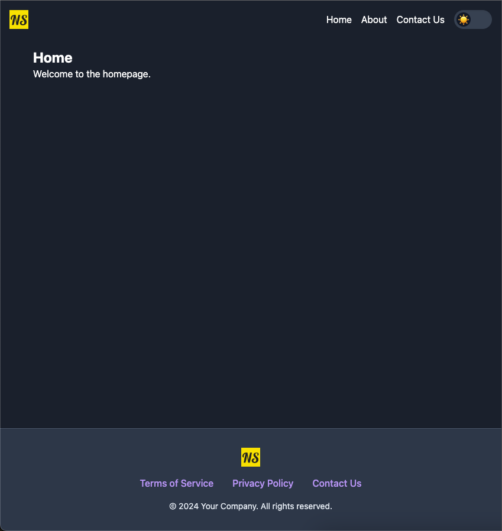

# JavaScript Pro Kit (JSPK)

## Overview
The JavaScript Pro Kit (JSPK) is a comprehensive, modular development system designed to streamline and enhance the development of JavaScript-based applications. JSPK integrates modern development tools and best practices, providing a robust foundation for building scalable and maintainable web applications.

## Key Features

### 1. Modular JavaScript Architecture
- **Component-Based Design**: JSPK promotes the use of self-contained, reusable components, each encapsulating its HTML, CSS, and JavaScript.
- **Easy Integration**: Components can be easily imported and utilized across different parts of the application, promoting code reuse and reducing redundancy.

### 2. Webpack
- **Efficient Bundling**: Webpack handles the bundling of JavaScript, CSS, and assets, optimizing the application for performance.
- **Hot Module Replacement**: Facilitates fast development by enabling modules to be updated without a full page refresh.

### 3. Babel
- **ES6+ Support**: Transpiles modern JavaScript syntax to ensure compatibility with older browsers.
- **Plugin Ecosystem**: Extend Babel’s functionality with a wide range of plugins for various use-cases.

### 4. ESLint
- **Code Quality**: ESLint enforces coding standards and detects potential errors in the codebase, ensuring code consistency and reliability.

### 5. NPM
- **Package Management**: Easily manage project dependencies and scripts with NPM, the Node Package Manager.

### 6. Redux
- **State Management**: Centralized state management using Redux allows for predictable state updates and easier debugging.
- **Middleware Support**: Integrate middleware for handling asynchronous actions and other side effects.

### 7. Navigo
- **Client-Side Routing**: Simplifies routing in single-page applications (SPA) with a lightweight, easy-to-use router.

## Additional Tools

### 1. Tailwind CSS
- **Utility-First CSS Framework**: Offers low-level utility classes that enable rapid and custom styling without leaving your HTML.

### 2. Local Storage Management
- **State Persistence**: Utilizes local storage to persist user preferences and application state across sessions.

## Project Structure
```
src
├── assets
│   └── logo.png
├── components
│   ├── navbar.js
│   ├── home.js
│   └── about.js
├── index.js
├── index.html
├── actions.js
├── router.js
├── store.js
├── styles.css
└── reducer.js
```

## Getting Started

### Prerequisites
- Node.js and npm installed on your machine.

### Installation

1. **Clone the repository:**
   ```sh
   git clone https://github.com/yourusername/jspk.git
   cd jspk
   ```

2. **Install dependencies:**
   ```sh
   npm install
   ```

### Development

1. **Start the development server:**
   ```sh
   npm start
   ```
   This will start a development server with hot module replacement enabled.

2. **Build for production:**
   ```sh
   npm run build
   ```
   This will bundle the application for production and output the files to the `dist` directory.

3. **Lint the code:**
   ```sh
   npm run lint
   ```
   This will run ESLint to check for code quality issues.

### Usage

- Navigate to `http://localhost:9000` to view the application in development mode.
- Use the navigation links in the navbar to switch between pages.

### Contributing

1. **Fork the repository**
2. **Create your feature branch:**
   ```sh
   git checkout -b feature/YourFeature
   ```
3. **Commit your changes:**
   ```sh
   git commit -m 'Add some feature'
   ```
4. **Push to the branch:**
   ```sh
   git push origin feature/YourFeature
   ```
5. **Open a pull request**

### License

This project is licensed under the MIT License. See the [LICENSE](LICENSE) file for details.

### Acknowledgments
- Thanks to the contributors of [Webpack](https://webpack.js.org/), [Babel](https://babeljs.io/), [ESLint](https://eslint.org/), [Redux](https://redux.js.org/), [Navigo](https://github.com/krasimir/navigo), and [Tailwind CSS](https://tailwindcss.com/) for their fantastic tools and libraries.

## Screenshot

